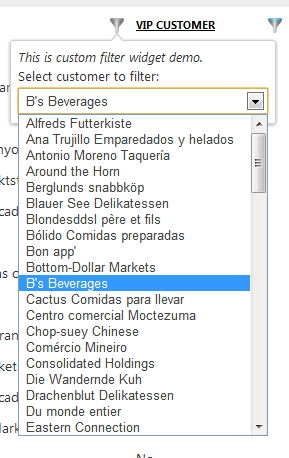

## Blazor WASM with GridCore back-end (REST API)

# Creating custom filter widget

[Index](Documentation.md)

The default **GridBlazor** render filter widget for a text column looks like:


But you can provide a more specific filter widget for this column. For example, image that you want users pick a customer from customer's list, like:




Follow thes steps to create a custom filter widget:

1. Create a blazor page for the new widget 

    Your blazor page should contain the following parameters:

    * **GridHeaderComponent**: it has two methods to add and remove a filter to the column:
        * **AddFilter**: adds a filter to the column. This method must be called by the **Apply** button of the widget
        * **RemoveFilter**: removes the filter to the column. This method must be called by the **Clear** button of the widget
    * **visible**: boolean to control if the widget is shown or not
    * **filterType**: string for the selected filter type. It can be one of these characters:
        * **1**: Equals
        * **2**: Contains
        * **3**: StartsWith
        * **4**: EndsWidth
        * **5**: GreaterThan
        * **6**: LessThan
        * **7**: GreaterThanOrEquals
        * **8**: LessThanOrEquals
    * **filterValue**: string for the value of the filter

    Example of a blazor page for a filter widget (you can find it in the sample **GridBlazor.Demo.Client** project with the file name **CustomersFilterComponent.razor**):

    ```razor
        @using GridBlazor
        @using GridBlazor.Resources
        @using GridShared.Filtering
        @using System.Collections.Generic
        @using System.Net.Http
        @inject NavigationManager NavigationManager
        @inject HttpClient HttpClient
        @inject IJSRuntime jSRuntime

        @typeparam T

        @if (visible)
        {
            <div class="dropdown dropdown-menu grid-dropdown opened" style="display:block;" 
                @onkeyup="FilterKeyup" @onclick:stopPropagation @onkeyup:stopPropagation>
                <div class="grid-dropdown-arrow"></div>
                <div class="grid-dropdown-inner">
                    <div class="grid-popup-widget">
                        <div class="form-group">
                            <p><i>This is custom filter widget demo</i></p>
                            <select @ref="firstSelect" class="grid-filter-type customerslist form-control" 
                                style="width:250px;" @bind="_filterValue">
                                @foreach (var customerName in _customersNames)
                                {
                                    <option value="@customerName">@customerName</option>
                                }
                            </select>
                        </div>
                        <div class="grid-filter-buttons">
                            <button type="button" class="btn btn-primary grid-apply" @onclick="ApplyButtonClicked">
                                @Strings.ApplyFilterButtonText
                            </button>
                        </div>
                    </div>
                    <div class="grid-popup-additional">
                        @if (_clearVisible)
                        {
                            <ul class="menu-list">
                                <li>
                                    <a class="grid-filter-clear" href="javascript:void(0);" @onclick="ClearButtonClicked">
                                        @Strings.ClearFilterLabel
                                    </a>
                                </li>
                            </ul>
                        }
                    </div>
                </div>
            </div>
        }

        @code {
            private bool _clearVisible = false;
            protected string _filterValue;
            private List<string> _customersNames = new List<string>();

            protected ElementReference firstSelect;

            [CascadingParameter(Name = "GridHeaderComponent")]
            private GridHeaderComponent<T> GridHeaderComponent { get; set; }

            [Parameter]
            public bool visible { get; set; }

            [Parameter]
            public string ColumnName { get; set; }

            [Parameter]
            public IEnumerable<ColumnFilterValue> FilterSettings { get; set; }

            protected override async Task OnInitializedAsync()
            {
                string url = NavigationManager.BaseUri + "api/SampleData/GetCustomersNames";
                _customersNames = await HttpClient.GetJsonAsync<List<string>>(url);
            }

            protected override void OnParametersSet()
            {
                _filterValue = FilterSettings.FirstOrDefault().FilterValue;
                _clearVisible = !string.IsNullOrWhiteSpace(_filterValue);
            }

            protected override async Task OnAfterRenderAsync(bool firstRender)
            {
                if (firstRender && firstSelect.Id != null)
                {
                    await jSRuntime.InvokeVoidAsync("gridJsFunctions.focusElement", firstSelect);
                }
            }

            protected async Task ApplyButtonClicked()
            {
                await GridHeaderComponent.AddFilter(new FilterCollection(GridFilterType.Equals.ToString("d"), _filterValue));
            }

            protected async Task ClearButtonClicked()
            {
                await GridHeaderComponent.RemoveFilter();
            }

            public async Task FilterKeyup(KeyboardEventArgs e)
            {
                if (e.Key == "Escape")
                {
                    await GridHeaderComponent.FilterIconClicked();
                }
            }
        }

    ```

    This example loads a customer's list from the server using a web service call. So we had to crealte a webservice in the server project to get a list of clients. But it is not mandatory to use a web service call. This example always uses a **filterType** with value **1** when calling the **GridHeaderComponent.AddFilter** method.

2. In the **functions** area of the grid razor page you must create an empty **QueryDictionary** an add the custom filter widget created is step 1 using a unique name:

   ```c#
      private IQueryDictionary<Type> _customFilters = new QueryDictionary<Type>();

      protected override async Task OnInitAsync()
      {
          ...

          _customFilters.Add("CompanyNameFilter", typeof(CustomersFilterComponent<Order>));

          ...
      }

   ```

3. Add a new atribute to the **GridComponent** called **CustomFilters** where we pass the dictionary created in the step 2:

    ```razor
        <GridComponent T="Order" Grid="@_grid" CustomFilters="@_customFilters"></GridComponent>
    ```

4. Add the new filter widget to the colum that will use it. This is done in the lambda expression that creates the column's definition:

    ```c#
        public static Action<IGridColumnCollection<Order>> Columns = c =>
        {
            ...

            c.Add(o => o.Customer.CompanyName).SetFilterWidgetType("CompanyNameFilter");
            ...
        };
    ```
    You have to use the same unique name used on the step 2.

[<- Using a date time filter](Using_datetime_filter.md) | [Setup initial column filtering ->](Setup_initial_column_filtering.md)