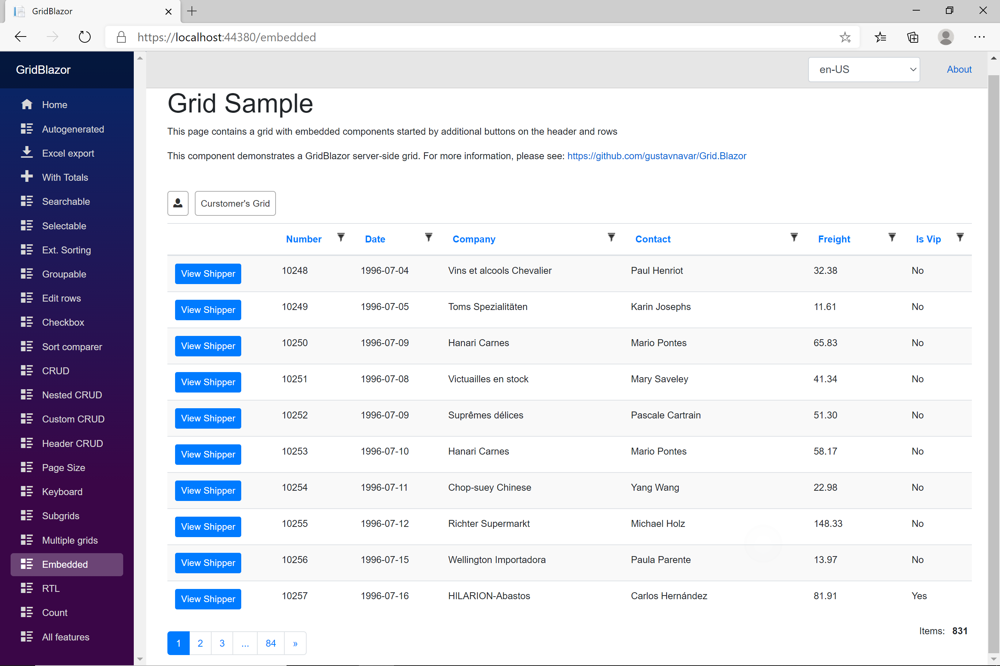

## Blazor client-side

# Button components on the grid

[Index](Documentation.md)

Compoments can be embedded on a grid. These components can be started clicking on a button on the top of the grid or in the grid columns. On both cases they will be shown on the screen instead of the grid.

## Page definition

* If you want to use a button on the top of the grid to start the embedded component, you can use the **AddButtonComponent** method of the **GridClient** object to add a component:
    
    ```c#
        var client = new GridClient<Order>(httpClient, url, query, false, "ordersGrid", Columns, locale)
            .AddButtonComponent<EmployeeComponent>("Employees", "Employee's Grid");
    ```

    **AddButtonComponent** method has 2 required paramenter and 3 optional ones:

    Parameter | Type | Description
    --------- | ---- | -----------
    Name| string | unique name in the grid to identify the embedded component
    Label| string | label to be shown on the screen
    Actions | IList<Action<object>> (optional) | the parent component can pass a list of Actions to be used by the component
    Functions | IList<Func<object,Task>> (optional) | the parent component can pass a list of Functions to be used by the child component
    Object | object (optional) | the parent component can pass an object to be used by the component

    If you use any of these paramenters, you must use them when creating the component.

* If you want to use a button in a grid column to start the embedded component, you has to render a button in a grid cell custom column:
    
    ```c#
        c.Add().Encoded(false).Sanitized(false).RenderComponentAs<ShipperButtonCell>();
    ```
    You can use any option described in the [documentation](Render_button_checkbox_etc_in_a_grid_cell.md)

    This button component has 2 specific requirements:
    - It must implement the ```ICustomGridComponent<T>``` interface. 
    - It must start the embedded component using the ```StartFormComponent<TFormComponent>``` method of the parent ```GridComponent```.
    
    The ```StartFormComponent<TFormComponent>``` method has 1 required parameter and 3 optional ones:

    Parameter | Type | Description
    --------- | ---- | -----------
    Label| string | label to be shown on the screen
    Actions | IList<Action<object>> (optional) | the parent component can pass a list of Actions to be used by the component
    Functions | IList<Func<object,Task>> (optional) | the parent component can pass a list of Functions to be used by the child component
    Object | object (optional) | the parent component can pass an object to be used by the component

    This is an example for ```ShipperButtonCell```:
    ```c#
        @implements ICustomGridComponent<Order>

        @if (Item.Shipper != null)
        {
            <button class='btn btn-sm btn-primary' @onclick="MyClickHandler">View Shipper</button>
        }

        @code {

            [CascadingParameter(Name = "GridComponent")]
            public GridComponent<Order> GridComponent { get; set; }

            [Parameter]
            public Order Item { get; set; }

            private void MyClickHandler(MouseEventArgs e)
            {
                GridComponent.StartFormComponent<ShipperComponent>("Shipper Information", null, null, Item.Shipper);
            }
        }
    ```

## Component definition

You must also create the Blazor component that you want to embed. The 5 optional parameters are allowed:

Parameter | Type | Description
--------- | ---- | -----------
GridComponent | GridComponent<T> (optional) | Cascading parameter to access the parent component
Grid | CGrid<T> (optional) | Grid can be used to get any required information
Actions | IList<Action<object>> (optional) | the parent component can pass a list of Actions to be used by the component
Functions | IList<Func<object,Task>> (optional) | the parent component can pass a list of Functions to be used by the child component
Object | object (optional) | the parent component can pass an object to be used by the component

**Actions**, **Functions** and **Object** must be used when calling the **AddButtonComponent** method, but **Grid** can be used without this requirement.
 
The component can include any html elements as well as any event handling features.

This is an example of a grid with 2 additional components:




[<- Events](Events.md) | [Export to Excel ->](Excel_export.md)