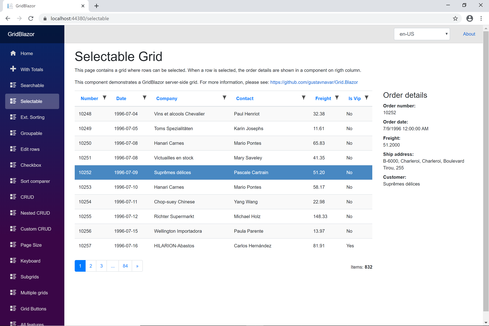

## Blazor client-side

# Selecting row

[Index](Documentation.md)

There are 2 ways to configure selecting rows:
- using the ```Selectable``` method of the ```GridClient``` object
- using the ```SetCheckboxColumn``` or ```SetSingleCheckboxColumn``` methods on the column definition

## Selectable method

The ```GridClient``` object has a method called ```Selectable``` to configure if a row can be selected. 
It's value can be ```true``` and ```false```. 
Since the version 1.1.0 of the GridBlazor nuget package the default value of the ```Selectable``` feature is ```false``` (it was ```true``` for earlier versions).

There are optional parameters to control selection behavior:

- Auto Select First Row:
    There is an optional boolean parameter to control if the first row should automatically be selected when a page loads.
    It's value can be ```true``` and ```false```. 
    By default this parameter's value is ```false```. 
- Allow Multi Select:
    There is an optional boolean paramter to control if multiple rows can be selected. 
    It's value can be ```true``` and ```false```.
    By default this parameter's value is ```false```.
    You can select multiple rows while pressing the [Ctrl] key
    You select multiple adjacent rows by clicking on the first row holding down the [Shift] key and then clicking on the last row of the interval keeping the [Shift] key held down

Rows configured in this way will be highlighted when selected.

You can enable it as follows:
```c#
    var client = new GridClient<Order>(httpClient, url, query, false, "ordersGrid", Columns)
        .Selectable(true, true, true);
```

You have to add the ```OnRowClicked``` attribute on the component. For example, the razor page can contain the following line:
```razor
    <GridComponent T="Order" Grid="@_grid" OnRowClicked="@OrderDetails"></GridComponent>
```

Then you have to add the function called by the event. In this example its name is ```OrderDetails```:
```c#
    protected void OrderDetails(object item)
    {
        Order order = null;
        if (item.GetType() == typeof(Order))
        {
            order = (Order)item;
        }
        Console.WriteLine("Order Id: " + (order == null ? "NULL" : order.OrderID.ToString()));
    }
```

In this sample a line of text with the selected row id is writen on the console log.

When items are selected in grid, collection of selected items are available using SelectedItems property. SelectedItems property is of type IEnumerable<object>.

```c#
    var items = client.Grid.SelectedItems.ToList<T>();
```

In the GridBlazorClientSide.Client project you will find another example where the order details are shown on a component when a row is selected.

### Selecting rows for subgrids

GridBlazor 1.3.30 and newer versions implement ```OnRowClickedActions``` to allow row click for all subgrids.

You have to create a ```List<Action<object>>()``` and add all row click method for nested subgrids in the same order they are nested:

```c#
    _rowClickActions = new List<Action<object>>();
    _rowClickActions.Add(OrderInfo);
    _rowClickActions.Add(OrderDetailInfo);
```

And finally you have to pass the list as parameter of the ```GridComponent```:

```c#
    <GridComponent T="Order" Grid="@_grid" OnRowClickedActions="@_rowClickActions" />
```

This is an example of grid using ```Selectable```:




## SetCheckboxColumn method

You can add one or more columns with checkboxes on each row.

```c#
    c.Add("CheckboxColumn").SetCheckboxColumn(true, o => o.Customer.IsVip);
    c.Add(o => o.OrderID).SetPrimaryKey(true);
```

Columns defined in this way must be not connected ones (defined with ```Add()``` method). But they can have a name (defined with ```Add("columnName")``` method).

It's also mandatory to identify the columns that are primary keys for the grid. You must do it using the ```SetPrimaryKey(true)``` method for the primary key columns' definitions.

```SetCheckboxColumn``` method has 3 parameters:
- headerCheckbox: it's a boolean value to enable the checkbox on the header
- expression: it's a ```Func<T, bool>``` to define the initial value of the checkbox for each row
- readonlyExpr (optional): it's a ```Func<T, bool>``` to configure the checkbox for each row as read only

**Important:** ```CheckedRows``` property is not available since release 1.6.2. ```CheckedRows``` only allowed to retrieve the checked values, but not to change them. Use the ```Checkboxes``` property instead of it.

If you want to retrieve or change the checked values for each row, you can use the ```Checkboxes``` property of the ```GridComponent``` object. 
It is a dictionary that contains references to all checkbox components for each column.

Row IDs are the keys of this dictionary. Rows are numbered starting by 0.

The ```CheckboxComponent<T>``` object contains 2 methods to get and set the checked value:
- IsChecked(): It retrieves the current value
- SetChecked(bool): It changes the checkbox value

This is an example showing how to access both methods:
```c#
    private GridComponent<Order> _gridComponent;
    
    ...
    
    Dictionary<int, CheckboxComponent<Order>> checkboxes = _gridComponent.Checkboxes.Get("CheckboxColumn");
    bool isChecked = checkboxes[0].IsChecked();
    if (isChecked)
        await checkboxes[0].SetChecked(false);
```

Blazor pages using checkboxes may require to use the ```ShouldRender``` method to suppress UI refreshing. See this [sample](https://github.com/gustavnavar/Grid.Blazor/blob/master/GridBlazorClientSide.Client/Pages/Checkbox.razor) as reference.

These events are provided by the ```GridComponent``` object to allow running tasks on changing checkboxes:
- ```Func<CheckboxEventArgs<T>, Task> HeaderCheckboxChanged```: it's fired when a header checkbox is changed
- ```Func<CheckboxEventArgs<T>, Task> RowCheckboxChanged```: it's fired when a row checkbox is changed

This is an example of grid using ```SetCheckboxColumn```:


## SetSingleCheckboxColumn method

This case is very similar to the previous one, with the exception of only one checkbox selected at a time. 
When you select a checkbox, any other checkboxes are automatically unchecked.

You can add one or more columns with checkboxes on each row.

```c#
    c.Add("CheckboxColumn").SetSingleCheckboxColumn();
    c.Add(o => o.OrderID).SetPrimaryKey(true);
```
Columns defined in this way must be not connected ones (defined with ```Add()``` method). But they can have a name (defined with ```Add("columnName")``` method).

It's also mandatory to identify the columns that are primary keys for the grid. You must do it using the ```SetPrimaryKey(true)``` method for the primary key columns' definitions.

```SetSingleCheckboxColumn``` method has no parameters.

[<- Grouping](Grouping.md) | [Searching ->](Searching.md)