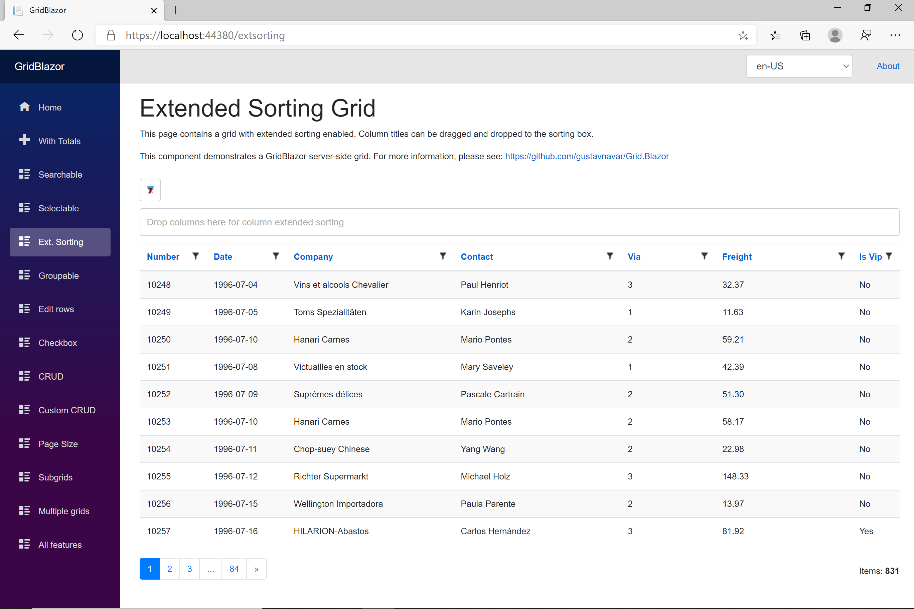

## Blazor client-side

# Sorting

[Index](Documentation.md)

## Regular Sorting
You can enable sorting for all columns of a grid using the **Sortable** method for both **GridClient** and **GridServer** objects:
* Client project
    ```c#
        var client = new GridClient<Order>(url, query, false, "ordersGrid", Columns, locale)
            .Sortable();
    ```

* Server project
    ```c#
        var server = new GridServer<Order>(repository.GetAll(), Request.Query, true, "ordersGrid", columns, 10)
            .Sortable();
    ```

In this case you can select sorting pressing the column name on just one column at a time

Sorting at grid level has precendence over sorting defined at column level.


## Extended Sorting
You can also configure extended sorting using the **ExtSortable** method for both **GridClient** and **GridServer** objects:
* Client project
    ```c#
        var client = new GridClient<Order>(url, query, false, "ordersGrid", Columns, locale)
            .ExtSortable();
    ```

* Server project
    ```c#
        var server = new GridServer<Order>(repository.GetAll(), Request.Query, true, "ordersGrid", columns, 10)
            .ExtSortable();
    ```

In this case you can drag the column title and drop it on the sorting area. You can add multiple columns at the same time and select if sorting is ascending or descending column by column.

This is an example of a table of items using extended sorting:




[<- Totals](Totals.md) | [Grouping ->](Grouping.md)