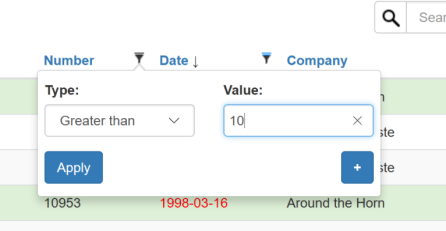

## Blazor WASM with GridCore back-end (gRPC)

# Filtering

[Index](Documentation.md)

You can enable the filtering option for your columns. To enable this functionality use the **Filterable** method of the **Column** object:

```c#
    Columns.Add(o => o.Customers.CompanyName)
        .Titled("Company Name")
        .Filterable(true)
        .Width(220);
```
After that you can filter this column. 

You can enable filtering for all columns of a grid using the **Filterable** method for both **GridClient** and **GridCoreServer** objects:

* Client project
    ```c#
        var client = new GridClient<Order>(gridClientService.GetOrdersGridRows, query, false, "ordersGrid", Columns, locale)
            .Filterable();
    ```

* Server project
    ```c#
        var server = new GridCoreServer<Order>(repository.GetAll(), Request.Query, true, "ordersGrid", columns, 10)
            .Filterable();
    ```

You can enable a button to clear all selected filters using the ***ClearFiltersButton*** method of the **GridClient** object:  

```c#
    var client = new GridClient<Order>(gridClientService.GetOrdersGridRows, query, false, "ordersGrid", Columns).ClearFiltersButton(true);
```

**GridBlazor** supports several types of columns (specified in the **Add** method):

* System.String
* System.Guid
* System.Int32
* System.Int64
* System.Boolean
* System.DateTime
* System.Decimal
* System.Byte
* System.Double
* System.Single
* enum

It also supports nullable types of any element of the list.

**GridBlazor** has different filter widgets for these types:
* **TextFitlerWidget**: it provides a filter interface for text columns (System.String). This means that if your column has text data, **GridBlazor** will render an specific filter interface:

    

* **NumberFilterWidget**: it provides a filter interface for number columns (System.Int32, System.Decimal etc.)

    

* **BooleanFilterWidget**: it provides a filter interface for boolean columns (System.Boolean):

    

* **DateTimeFilterWidget**: it provides a filter interface for datetime columns (System.DateTime):

    

## Multiple filters

Pressing the **+** and **-** buttons you can add multiple options to filter. You can also select the condition you want to use, either **And** or **Or**:


You can also create your own filter widgets.

# Disable diacritics distinction

GridBlazor distinguishes among letters with diacritics by default. If you filter by the term "bru, it will return all records that contains "bru", but it won't returns any record containing "brú", "brû" or "brü". 

Anyway, it is possible to override the default behavior, so GridBlazor will return any record containing "brú", "brû" or "brü". 

The solution to be implemented will depend on the back-end used to return the grid data. I will describe the following 2 cases:

- for grids using Entity Framework Core it will be necessary to create a stored function on the database, a static method that will call it and configure the ```GridCoreServer``` object:
    1. For SQL Server you should open the ```SQL Server Studio Management``` tool and execute the following SQL query on your database to create the ```RemoveDiacritics``` function: 
        
       ```sql
            CREATE FUNCTION [dbo].[RemoveDiacritics] (
                @input varchar(max)
            )   RETURNS varchar(max)

            AS BEGIN
                DECLARE @result VARCHAR(max);

                select @result = @input collate SQL_Latin1_General_CP1253_CI_AI

                return @result
            END
        ``` 
    2. then you must create the following static function with an string parameter and returning an string. This function will only work from a LINQ expression and it will call the stored function defined before:
        
       ```c#
            public class NorthwindDbContext : GridShared.Data.SharedDbContext<NorthwindDbContext>
            {
 
                ...

                [DbFunction("RemoveDiacritics", "dbo")]
                public static string RemoveDiacritics(string input)
                {
                     throw new NotImplementedException("This method can only be called using LINQ");
                }
            }
        ```
    3. and finally you must call the ```SetRemoveDiacritics``` method of the ```GridCoreServer``` class:
        
       ```c#
            var server = new GridCoreServer<Order>(repository.GetAll(), Request.Query, true, "ordersGrid", ColumnCollections.OrderColumns)
                .Filterable()
                .SetRemoveDiacritics<NorthwindDbContext>("RemoveDiacritics");
        ```

- for data stored in memory you must create the static function that will remove diacritics and configure the ```GridCoreServer``` object:
    1. you must create the following static function with an string parameter and returning an string (other functions removing diacritics are also supported):
        
       ```c#
            public class StringUtils
            {
 
                ...

                public static string RemoveDiacritics(string text)
                {
                    var normalizedString = text.Normalize(NormalizationForm.FormD);
                    var stringBuilder = new StringBuilder();

                    foreach (var c in normalizedString)
                    {
                        var unicodeCategory = CharUnicodeInfo.GetUnicodeCategory(c);
                        if (unicodeCategory != UnicodeCategory.NonSpacingMark)
                        {
                            stringBuilder.Append(c);
                        }
                    }

                    return stringBuilder.ToString().Normalize(NormalizationForm.FormC);
                }
            }
        ```
    2. and finally you must call the ```SetRemoveDiacritics``` method of the ```GridCoreServer``` class:
        
       ```c#
            var server = new GridCoreServer<Order>(repository.GetAll(), Request.Query, true, "ordersGrid", ColumnCollections.OrderColumns)
                .Filterable()
                .SetRemoveDiacritics<StringUtils>("RemoveDiacritics");
       ```

[<- Searching](Searching.md) | [Using a list filter->](Using_list_filter.md)