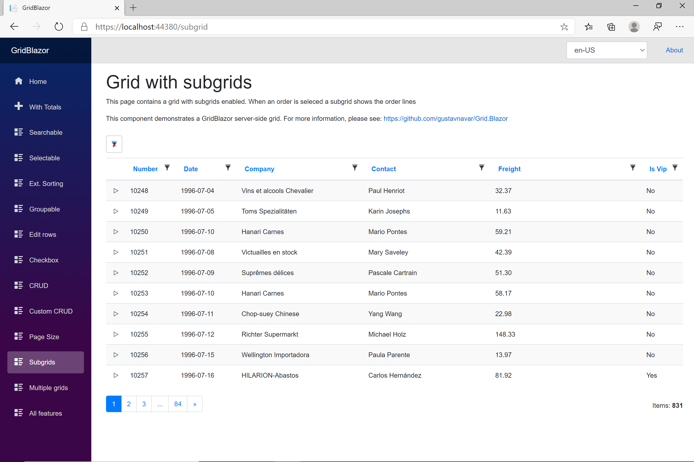

## Blazor WASM with local data

# Subgrids

[Index](Documentation.md)

You can enable the subgrids support for your grid. Subgrids allows to view records for those tables that have a 1 to N relationship with the parent table of the main grid.



We asume that you already configured the parent grid and it's working as expected as described in the [Quick start](Quick_start.md) section.

We have to add a service method to get rows for subgrids. An example of this type of service is: 

```c#
    public class OrderService
    {
        ...

        public ItemsDTO<OrderDetail> GetOrderDetailsGridRows(Action<IGridColumnCollection<OrderDetail>> columns, 
            object[] keys, QueryDictionary<StringValues> query)
        {
            int orderId;
            int.TryParse(keys[0].ToString(), out orderId);
            var repository = new OrderDetailsRepository(_context);
            var server = new GridCoreServer<OrderDetail>(repository.GetForOrder(orderId), new QueryCollection(query),
                true, "orderDetailssGrid" + keys[0].ToString(), columns)
                    .Sortable()
                    .WithPaging(10)
                    .Filterable()
                    .WithMultipleFilters();

            // return items to displays
            var items = server.ItemsToDisplay;
            return items;
        }
    }
```

This service method is very similar to the one we used for the main grid. The only difference is that this one has a new parameter named **keys**.
It is an array of strings with the names of required columns to find records for the subgrid. 
In our example this array has only one element for the **OrderId** field.
We use it to get the subgrid rows calling the **GetForOrder** method from the repository.

Note that the grid name parameter we use must be unique for each subgrid. In this example we use the name **"orderDetailsGrid" + keys[0].ToString()**.


We have to add the following elements on **OnInitAsync** method of the same razor page we used to render the main grid:

```razor
    protected override async Task OnInitAsync()
    {
        ...
        
        Action<IGridColumnCollection<OrderDetail>> orderDetailColumns = c =>
        {
            c.Add(o => o.OrderID);
            c.Add(o => o.ProductID);
            c.Add(o => o.Product.ProductName);
            c.Add(o => o.Quantity).Format("{0:F}");
            c.Add(o => o.UnitPrice).Format("{0:F}");
        };

        ...

        Func<object[], Task<ICGrid>> subGrids = async keys =>
        {
            var subGridQuery = new QueryDictionary<StringValues>();
            var subGridClient = new GridClient<OrderDetail>(q => orderService.GetOrderDetailsGridRows(orderDetailColumns, keys, q), 
                subGridQuery, false, "orderDetailsGrid" + keys[0].ToString(), orderDetailColumns, locale)
                    .SetRowCssClasses(item => item.Quantity > 10 ? "success" : string.Empty)
                    .Sortable()
                    .Filterable()
                    .WithMultipleFilters()
                    .WithGridItemsCount();

            await subGridClient.UpdateGrid();
            return subGridClient.Grid;
        };

    }
```
The new 2 elements are:
- the column defintion for the subgrid 
- and a function to create the subgrids for each **keys** parameter. It's important to declare all variables needed by the contructor of the **GridClient** object inside the function block to avoid sharing parameters among subgrids. 

Finally we have to modify the **GridClient** we used to create the main grid adding a **SubGrid** method:

```razor
    protected override async Task OnInitAsync()
    {
        ...

        var client = new GridClient<Order>(q => orderService.GetOrdersGridRows(orderColumns, q), query, false,
            "ordersGrid", orderColumns, locale)
            .SetRowCssClasses(item => item.Customer.IsVip ? "success" : string.Empty)
            .Sortable()
            .Filterable()
            .WithMultipleFilters()
            .Searchable(true, false)
            .WithGridItemsCount()
            .SubGrid(subGrids, ("OrderID","OrderID"));

    }
```

## SubGrid parameters

Parameter | Type | Description
--------- | ---- | -----------
subGrids | Func<object[], Task<ICGrid>> | function that creates subgrids defined in the step before
allOpended | bool (optional) | boolean to configure if all subgrids are opened or closed when the grid is initialized or updated. The default value is false.
keys | params (string, string)[] | variable number of tuples of strings with the names of required columns to find records for the subgrid (foreign keys). The first value of the tuple is the name of property of the parent grid and the second value is the name of property of the child grid.

[<- Render button, checkbox, etc. in a grid cell](Render_button_checkbox_etc_in_a_grid_cell.md) | [Passing grid state as parameter ->](Passing_grid_state_as_parameter.md)