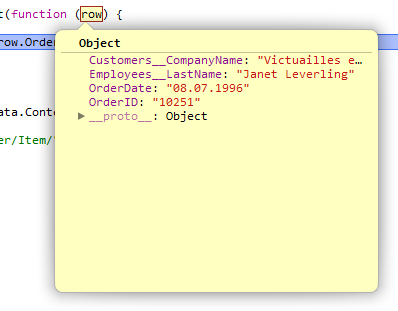

## GridMvc for ASP.NET Core MVC

# Client side object model

[Index](Documentation.md)

Client side object model allows to retrieve column values from a selected row in the grid.

It also allows to control paging, sorting and filtering using javascript.

And finally you can also send additional parameters in the request to the controller action, such as an anti-forgery token.

## Installation 

If you want to use the client side object model instead of using the default grid server management you have to follow the following steps:

1. Install the following client libraries on the project:
    * URI.js

2. Add the following lines to the _Layout.cshtml view or directly to the page that will use the client side object model:
    ```html
       <script src="~/js/gridmvc-ajax.js" type="text/javascript"></script>
       <script src="~/lib/URI.js/URI.js" type="text/javascript"></script>
    ```
    The **gridmvc-ajax.js** file will be loaded from the nuget package. This script provides filtering, paging and sorting functionality on the client side and also row selecting. This script registers a singleton object named **pageGrids** that contains all grids registered on the page.

## Grid creation

The steps to build a grid page using the client side object model are as follows:

1. Create a partial view containing your grid (e.g. **_OrdersGrid.cshtml**). You must specify a unique grid name using the **Named** method (unique among all grids on the same page). In our sample we will name it as **ordersGrid**:

    ```razor
       @using GridMvc
       @model SGrid<Order>

       @Html.Grid(Model).Named("ordersGrid").Columns(columns =>
       {
           columns.Add(o => o.OrderID).Titled("Custom column ID");
           columns.Add(o => o.OrderDate).Sortable(true);
       }).WithPaging(10).Sortable().Filterable().WithMultipleFilters()
   ```
  
2. Add two actions to the controller, one for the complete view and another to load the partial view:

    ```c#
        [HttpGet]
        public ActionResult Orders()
        {
            var repository = new OrdersRepository(_context);
            var model = new SGrid<Order>(repository.GetAll(), HttpContext.Request.Query, false, GridPager.DefaultAjaxPagerViewName);
            return View(model);
        }
        
        [HttpPost]
        public ActionResult GetOrdersGridRows()
        {
            var repository = new OrdersRepository(_context);
            var model = new SGrid<Order>(repository.GetAll(), HttpContext.Request.Query, false, GridPager.DefaultAjaxPagerViewName);
            return PartialView("_OrdersGrid", model);
        }
    ```
    The last action for the partial view must use a POST http method.


3. The view for the Orders action should contain two elements


    * an html helper call to create the partial view:

        ```razor
            @await Html.PartialAsync("_OrdersGrid")
        ```


    * the following script on the view to enable paging, sorting and filtering:	
    
        ```javascript
            <script>
                $(function () {
                    pageGrids.ordersGrid.ajaxify({
                        getPagedData: "/Home/GetOrdersGridRows"
                    });
                });
            </script>
        ```
    This script will allow to refresh the partial view from the server when paging, sorting or filtering. Remember to use the same **pageGrids** property name that we used to create the grid object in step 1. In our case it is **ordersGrid**. 

## Additional features

* One of the benefits of using the client side object is that one can retrieve column values from a selected row in the grid. In our sample we just make four changes to make it work:

    1. add the following content to the view. The **<div>** element will show the retrieved data:

        ```html
            <div id="order-content">
                <p class="muted">
                    Select order to display detailed infomation
                </p>
            </div>
        ```

    2. add an script to the view that will get the row data as json:

        ```javascript
            <script>
                $(function () {
                    pageGrids.ordersGrid.onRowSelect(function (e) {
                        $.get("/Home/GetOrder?id=" + e.row.OrderID, function (data) {
                            if (data.status <= 0) {
                                alert(data.message);
                                return;
                            }
                            $("#order-content").html(data.content);
                        });
                    });
                });
            </script>
        ```
        The method **onRowSelect** registers an event when a user selects a Grid row. The **e.row** parameter contains all column values of the selected row. You can retrive them by calling its properties:

        

    3. add an action in the controller that will return with the row's data as a json:

        ```c#
            [HttpGet]
            public ActionResult GetOrder(int id)
            {
                var repository = new OrdersRepository(_context);
                Order order = repository.GetById(id);
                if (order == null)
                    return Json(new { status = 0, message = "Not found" });

                return Json(new { status = 1, message = "Ok", content = RenderPartialViewToString("_OrderInfo", order) });
            }
        ```
        This action calls a function to convert a partial view to a string. You can use the following one:

        ```c#
            protected string RenderPartialViewToString(string viewName, object model)
            {
                if (string.IsNullOrEmpty(viewName))
                    viewName = ControllerContext.RouteData.Values["action"].ToString();

                ViewEngineResult viewResult = _compositeViewEngine.FindView(ControllerContext, viewName, false);

                var viewDictionary = new ViewDataDictionary(new EmptyModelMetadataProvider(), new ModelStateDictionary())
                {
                    Model = model
                };

                using (var sw = new StringWriter())
                {
                    var newViewContext = new ViewContext(
                        ControllerContext,
                        viewResult.View,
                        viewDictionary,
                        TempData,
                        sw,
                        new HtmlHelperOptions());
                    viewResult.View.RenderAsync(newViewContext).Wait();
                    return sw.ToString();
                }
            }
        ```

    4. Create a partial view to show the row data. In our sample it is called **_GetOrder** and contains:

        ```razor
           @model GridMvc.Demo.Models.Order
           <dl>
               <dt>Order number:</dt>
               <dd>@Model.OrderID</dd>


               @if (Model.OrderDate.HasValue)
               {
                   <dt>Order date:</dt>
                   <dd>@Model.OrderDate.Value.ToString()</dd>
               }

               <dt>Freight:</dt>
               <dd>@Model.Freight</dd>

               <dt>Ship address:</dt>
               <dd>@Model.ShipPostalCode, @Model.ShipCity, @Model.ShipCity, @Model.ShipAddress</dd>

               <dt>Customer:</dt>
               <dd>@Html.ActionLink(Model.Customer.CompanyName, "Index", "Home", new { id = Model.OrderID })</dd>
           </dl>
           <p>
               @Html.ActionLink("Edit order", "Edit", "Home", new { id = Model.OrderID }, new { @class = "btn btn-primary" })
           </p>

       ```

* Another benefits of using the client side object model is that you can also send additional parameters in the request to the controller action. We will show how to send an anti-forgery token:

    1. add an script to the view:

        ```javascript
            <script>
                function gettoken() {
                    var token = '@Html.AntiForgeryToken()';
                    token = $(token).val();
                    return token;
                }

                $(function () {
                    var token = gettoken();

                    pageGrids.ordersGrid.ajaxify({
                        getPagedData: "/Home/GetOrdersGridRows",
                        token: token
                    });
                });
            </script>
        ```
        The **gettoken** function get an anti-forgery token. The **ajaxify** method sends the anti-forgery token using the **token** property. 

    2. change the **GetOrdersGridRows** action in the controller that will return with the row's data as a json adding a **[ValidateAntiForgeryToken]** annotation:

        ```c#        
             [HttpPost]
             [ValidateAntiForgeryToken]
             public ActionResult GetOrdersGridRows()
             {
                 var repository = new OrdersRepository(_context);
                 var model = new SGrid<Order>(repository.GetAll(), HttpContext.Request.Query, false, GridPager.DefaultAjaxPagerViewName);
                 return PartialView("_OrdersGrid", model);
             }
         ```

[<- Localization](Localization.md) | [Multipile grids on the same page ->](Multipile_grids_on_the_same_page.md)