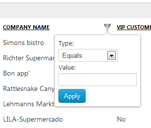

## GridMvc for ASP.NET Core MVC

# Creating custom filter widget

[Index](Documentation.md)

The default **GridMvc** render filter widget for a text column looks like:



But you can provide a more specific filter widget for this column. For example, image that you want users pick a customer from customer's list, like:


To do this you have to:
1. Create an specific javascript object, that will render your interface
2. Setup a custom filter widget name with the **SetFilterWidgetType** function
3. Register the custom filter on the client side

## Create a javascript widget object
Your javascript object should have the following functions:

* **getAssociatedTypes**: it returns an array of all filter types that are associated with the current widget
* **showClearFilterButton**: it returns true/false and defines if a **Clear filter** button will be rendered for the widget
* **onRender**: this function is invoked by **GridMvc**. It is invoked once, when a user click on filter button for the first time. It allows you to define the rendered content that will appear on your widget.
* **onShow**:  this function is invoked by **GridMvc** when the filter widget is shown on the page

Below there is an example of filter widget (you can find it in the sample **GridMvc.Demo** project):

```javascript

/***
* CustomersFilterWidget - Provides filter user interface for customer name column in this project
* This widget onRenders select list with avaliable customers.
*/

function CustomersFilterWidget() {

    /***
    * This method must return type of registered widget type in 'SetFilterWidgetType' method
    */
    this.getAssociatedTypes = function () {
        return ["CustomCompanyNameFilterWidget"];
    };

    /***
    * This method invokes when filter widget was shown on the page
    */
    this.onShow = function (columnName) {
        /* Place your on show logic here */
    };

    this.showClearFilterButton = function () {
        return true;
    };

    /***
    * This method will invoke when user was clicked on filter button.
    * container - html element, which must contain widget layout;
    * lang - current language settings;
    * typeName - current column type (if widget assign to multipile types, see: getAssociatedTypes);
    * columnName - current column name;
    * values - current filter values. Array of objects [{filterValue: '', filterType:'1'}]({filterValue_-'',-filterType_'1'});
    * cb - callback function that must invoked when user want to filter this column. Widget must pass filter type and filter value.
    * data - widget data passed from the server
    */
    this.onRender = function (container, lang, typeName, columnName, values, cb, data) {
        //store parameters:
        this.cb = cb;
        this.container = container;
        this.lang = lang;

        //this filterwidget demo supports only 1 filter value for column column
        this.value = values.length > 0 ? values[0](0) : { filterType: 1, filterValue: "" };

        this.renderWidget(); //onRender filter widget
        this.loadCustomers(); //load customer's list from the server
        this.registerEvents(); //handle events
    };
    this.renderWidget = function () {
        var html = '<p><i>This is custom filter widget demo.</i></p>\
                    <p>Select customer to filter:</p>\
                    <select style="width:250px;" class="grid-filter-type customerslist form-control">\
                    </select>';
        this.container.append(html);
    };

    /***
    * Method loads all customers from the server via Ajax:
    */
    this.loadCustomers = function () {
        var $this = this;
        $.post("/Home/GetCustomersNames", function (data) {
            $this.fillCustomers(data.Items);
        });
    };

    /***
    * Method fill customers select list by data
    */
    this.fillCustomers = function (items) {
        var customerList = this.container.find(".customerslist");
        for (var i = 0; i < items.length; i++) {
            customerList.append('<option ' + (items[i](i)(i)(i) == this.value.filterValue ? 'selected="selected"' : '') + ' value="' + items[i](i)(i)(i) + '">' + items[i](i)(i)(i) + '</option>');
        }
    };

    /***
    * Internal method that register event handlers for 'apply' button.
    */
    this.registerEvents = function () {
        //get list with customers
        var customerList = this.container.find(".customerslist");
        //save current context:
        var $context = this;
        //register onclick event handler
        customerList.change(function () {
            //invoke callback with selected filter values:
            var values = [{ filterValue: $(this).val(), filterType: 1 /* Equals */ }]({-filterValue_-$(this).val(),-filterType_-1-__-Equals-__-});
            $context.cb(values);
        });
    };

}
```

This example loads a customer's list from the server using a POST ajax call. It builds and renders the layout contained in the **onRender** method.

## Setup custom filter type 

You have to override the default filter type value using the **SetFilterWidgetType** function:

```c#
   columns.Add(o => o.Customers.CompanyName)
       .Titled("Company Name")
       .Sortable(true)
       .Filterable(true)
       .SetFilterWidgetType("CustomCompanyNameFilterWidget");
```

The filter type value must contain one of the **getAssociatedTypes** array values of your JS object created in the step 1. In this example that value is **CustomCompanyNameFilterWidget**.

## Register filter widget

Finally you have to add the custom widget in the **GridMvc** filters collection. You can do this by using **addFilterWidget** javascript function. Add the following script after **gridmvc.js** in your view:

```javascript
   <script>
        pageGrids.ordersGrid.addFilterWidget(new CustomersFilterWidget());
   </script>
```
where **CustomersFilterWidget** is the javascript object defined in step 1.

[<- Using a list filter](Using_list_filter.md) | [Setup initial column filtering ->](Setup_initial_column_filtering.md)